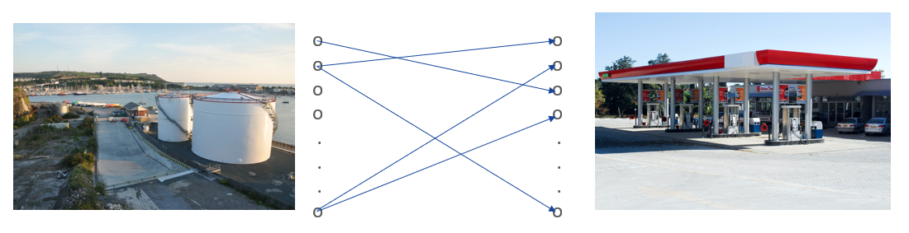
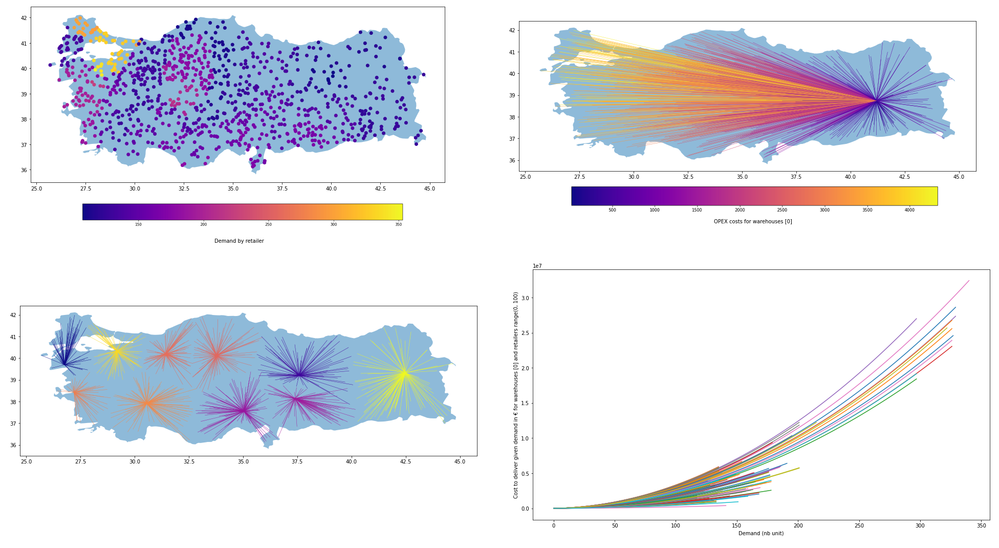

# A Facility Location Problem use case with FICO Xpress

This [tutorial](notebook/flp_xpress_mip_training.ipynb) illustrates how Mixed-Integer Programming can be used.

Following subjects are covered:

* Formulating a MIP program corresponding to a business problem
* Solving a MIP program using Xpress
* Analyzing a solution and its quality
* Learning to solve inconsistencies in a MIP model
* Using a linearization method for robust optimization
* Using a heuristic solution as initial solution of a MIP search
* Model and solve quadratic relations as a MIQP
* Approximate a quadratic cost into a piecewise linear cost

## Facility Location Problem use case

A company would like to extend its market by distributing its product in Turkey.
For this, they need to decide where to establish their warehouses, required to
distribute their product to their retailers.

The retailers are some gas stations, scattered all around the country. The
potential warehouses are oil depots that have to be built or bought.

Input data, problem solutions and various KPIs are geographically illustrated.

## About

This tutorial is a Jupyter Notebook using the [FICO Xpress Python API](https://pypi.org/project/xpress/).
